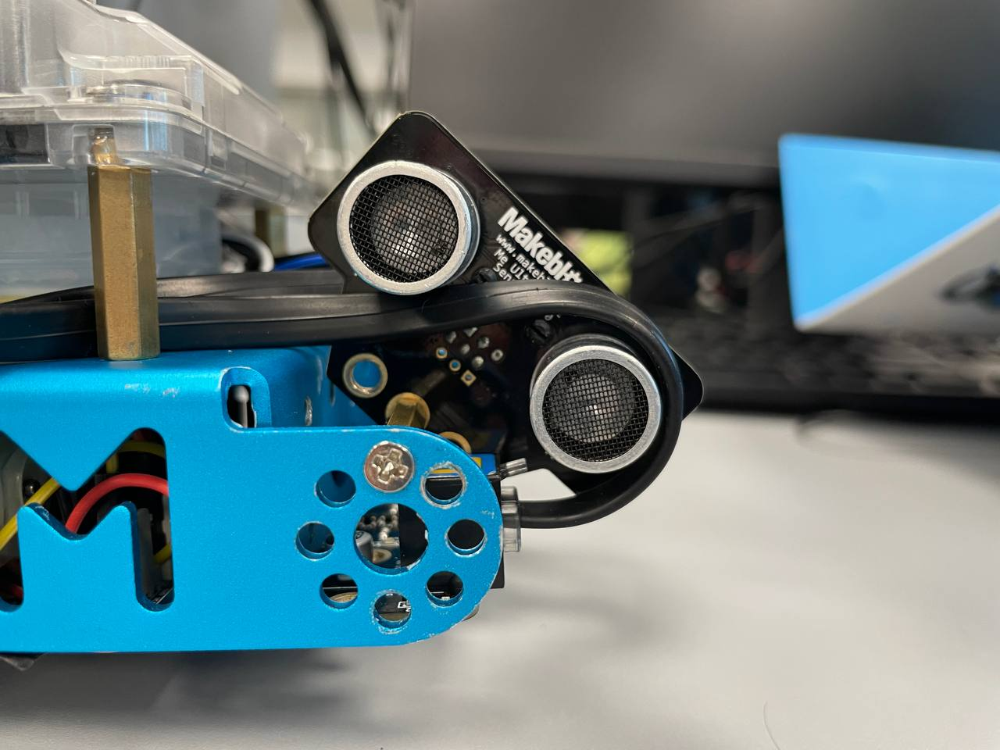
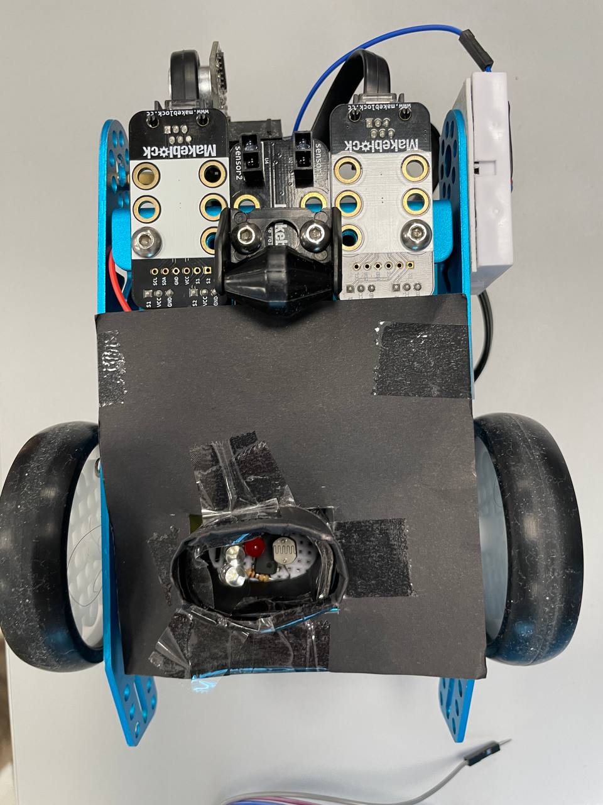

# CG1111A

Hello this is the source code for the NUS mod CG1111A ^_^ done by ryan, sze ying and jun xian





## Mbot Specs 
13cm X 19cm 


## Port 1 Black line detector

## Port 2 Ultrasonic
Ultrasonic pin D10

## Port3 2D to 4D
red vcc
black ground
yellow s2 A3
orange s1 A2


## M4 data readers
grey ground
white vcc 
purple s1  A0 LDR
blue s2    A1  ir receveier


## Motor config
Left Motor = M1
Right Motor = M2
leftMotor.run(200); // Left wheel goes forward (anti-clockwise)
rightMotor.run(-200);

## Colour Interpretation
Red Left-turn
Green Right turn
Light Blue Two successive right-turns in two grids
Orange 180° turn within the same grid
Purple Two successive left-turns in two grids


## Color list 
RED {239, 45, 45}

green{60, 110, 47}
blue {95, 160, 224}

orange {235,90, 40}
purple {159,99 ,145}
White{255,255,223}


## Ode to joy
```c

    buzzer.tone(e, 600);
    buzzer.tone(f, 600);
    buzzer.tone(g, 600);
    buzzer.tone(g, 600);
    buzzer.tone(f, 600);
    buzzer.tone(e, 600);
    buzzer.tone(d, 600);
    buzzer.tone(c, 600);
    buzzer.tone(c, 600);
    buzzer.tone(d, 600);
    buzzer.tone(e, 600);
    buzzer.tone(e, 600);
    buzzer.tone(d, 600);
    buzzer.tone(d, 600);
    buzzer.noTone();
    delay(500);
    buzzer.tone(e, 600);
    buzzer.tone(e, 600);
    buzzer.tone(f, 600);
    buzzer.tone(g, 600);
    buzzer.tone(g, 600);
    buzzer.tone(f, 600);
    buzzer.tone(e, 600);
    buzzer.tone(d, 600);
    buzzer.tone(c, 600);
    buzzer.tone(c, 600);
    buzzer.tone(d, 600);
    buzzer.tone(e, 600);
    buzzer.tone(d, 600);
    buzzer.tone(c, 600);
    buzzer.tone(c, 600);
```